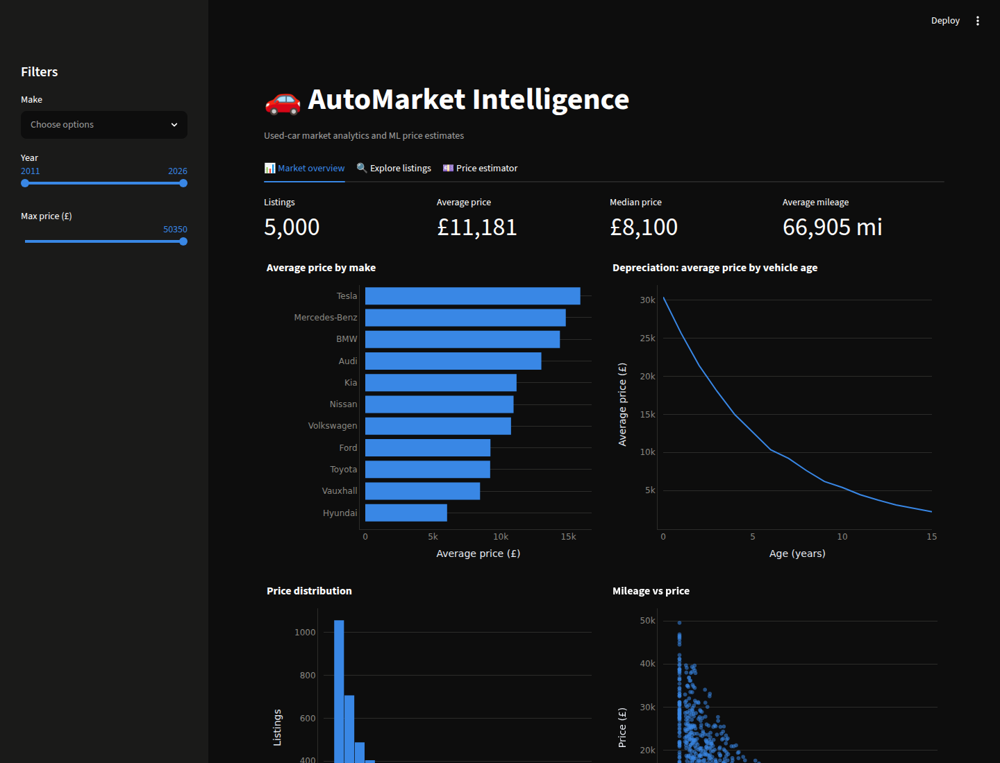

# 🚗 AutoMarket Intelligence Platform

A used-car market analytics platform: a REST API for browsing listings, Pandas-powered
market statistics, an ML model that estimates fair prices, and an interactive dashboard.



## The problem

Thousands of used cars are listed every day, but buyers and sellers have no easy way to
answer basic questions: *Is this car overpriced? What is a fair price for this model, year
and mileage? How fast do cars lose value?* This platform stores listing data, analyses the
market, and serves price estimates from a trained machine-learning model.

## Tech stack

| Area | Tools |
|---|---|
| API | Python, FastAPI, Pydantic |
| Database | SQLite, SQLAlchemy 2.0 |
| Data & ML | Pandas, scikit-learn |
| Dashboard | Streamlit, Plotly |
| Quality | pytest (22 tests), black, ruff, GitHub Actions CI |
| Deployment | Docker, docker-compose |

## Quickstart

```bash
cd AutoMarket-Intelligence-Platform
python -m venv .venv && source .venv/bin/activate
make install     # install the app + dev tools
make seed        # fill the database with 5,000 listings
make train       # train and evaluate the price model
make run         # API at http://localhost:8000/docs
make dashboard   # dashboard at http://localhost:8501
```

Or with Docker (seeds and trains automatically on first start):

```bash
docker compose up --build
# API on :8000, dashboard on :8501
```

## The data

Listings are generated synthetically (`app/data_generator.py`) rather than scraped:
scraping listing sites raises legal/terms-of-service issues and isn't reproducible.
The generator encodes real market behaviour — exponential depreciation with age,
mileage penalties, dealer and automatic-gearbox premiums, plus noise — with a fixed
random seed so every run produces the same dataset.

## The ML model

`python -m app.ml.train` compares three regression algorithms on an 80/20 train/test
split and saves the best one (by mean absolute error on unseen data):

| Model | MAE | RMSE | R² |
|---|---|---|---|
| LinearRegression | £2,851 | £3,575 | 0.835 |
| RandomForest | £668 | £1,028 | 0.986 |
| **HistGradientBoosting** | **£625** | **£956** | **0.988** |

Categorical features (make, model, fuel type, transmission, seller type) are one-hot
encoded inside a scikit-learn `Pipeline`, so preprocessing and model travel as one
artifact and can never disagree between training and prediction.

## API endpoints

| Method | Endpoint | Description |
|---|---|---|
| GET | `/api/health` | Liveness check |
| GET | `/api/listings` | Browse listings — filter by make/model/year/price, sort, paginate |
| GET | `/api/listings/{id}` | One listing |
| GET | `/api/stats/overview` | Market statistics (averages, popular makes, price by year) |
| POST | `/api/predict` | ML price estimate for a car's details |

Example:

```bash
curl -X POST localhost:8000/api/predict -H "Content-Type: application/json" -d '{
  "make": "Volkswagen", "model": "Golf", "year": 2021, "mileage": 40000,
  "fuel_type": "Petrol", "transmission": "Manual", "engine_size": 1.5
}'
# {"estimated_price": 12330, "currency": "GBP", "model_name": "HistGradientBoosting", "model_mae": 625}
```

Full interactive documentation (Swagger UI) at `/docs`.

## Project layout

```
app/
├── main.py             # FastAPI app: wires routes together
├── config.py           # typed settings from environment variables
├── database.py         # engine, session factory, get_db dependency
├── models.py           # SQLAlchemy ORM models
├── schemas.py          # Pydantic request/response shapes
├── data_generator.py   # reproducible synthetic listings
├── routes/             # endpoints: health, listings, stats, predict
└── ml/                 # train.py (compare & save), predictor.py (load & predict)
dashboard/dashboard.py  # Streamlit dashboard (reuses app's database + model code)
scripts/seed_data.py    # database seeding CLI
tests/                  # 22 tests against an in-memory database
```

## Testing

```bash
make test       # full suite (fast - uses an in-memory SQLite database)
make lint       # black + ruff (same checks CI runs)
```

The tests cover the data generator's market logic, every API endpoint (including
validation and 404 paths), and the full ML train → save → load → predict cycle.

## Design decisions & trade-offs

- **SQLite over PostgreSQL** — zero-setup local development; the SQLAlchemy layer means
  swapping to PostgreSQL is a one-line `DATABASE_URL` change.
- **`create_all` over migrations** — fine for a single evolving schema; Alembic would be
  the next step if the schema needed versioned changes in production.
- **Synthetic data over scraping** — legal, reproducible, and it forces explicit
  understanding of what drives prices.
- **No authentication** — the API is read-only over public-style data; JWT auth is a
  natural extension.

## Possible extensions

Depreciation forecasting per model, anomaly detection for mispriced listings,
PostgreSQL + Alembic, JWT user accounts with saved searches, and an LLM-powered
"market analyst" chat grounded in the platform's data.
