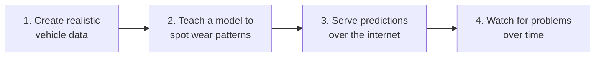

# FleetPulse — Predicting Vehicle Breakdowns Before They Happen


## The idea in one paragraph

Imagine you run a delivery company with 60 vehicles. Every breakdown on the road costs
you money: the recovery truck, the mechanic, the missed deliveries. But servicing every
vehicle every month "just in case" also wastes money, because most of them are fine.
The smart middle ground is to service a vehicle **when its own sensor data says it's
starting to wear out** — and that's what FleetPulse does. It reads a vehicle's recent
sensor history (engine temperature, oil pressure, vibration, and so on) and answers one
question: **"How likely is this vehicle to break down in the next 30 days?"**

Here's what an answer looks like. You send the system a vehicle's last few weeks of
sensor readings, and it replies:

```json
{
  "vehicle_id": "VH-0002",
  "failure_probability": 0.9741,
  "maintenance_recommended": true,
  "risk_band": "high",
  "threshold": 0.391
}
```

Translation: *"This vehicle has a 97% chance of breaking down soon — book it into the
workshop."*

> **For technical reviewers:** a detailed walkthrough of the code and the design
> decisions behind it is in [docs/CODE_ANALYSIS.md](docs/CODE_ANALYSIS.md). This README
> stays in plain English.

---

## How it works, step by step

The project has four parts, and they run in this order:



### Step 1 — Create realistic vehicle data

Real companies keep their vehicle data private, so this project **generates its own**.
It simulates 60 vehicles (small cars, delivery vans, and heavy trucks) driving every day
for a year. Each simulated vehicle slowly wears out inside the simulation — and as it
wears out, its sensors change the way a real vehicle's would: the engine runs hotter,
the oil pressure drops, the vibration gets worse. When the wear gets bad enough, the
vehicle "breaks down" and gets repaired.

The important trick: the program that later learns from this data is **never shown the
hidden wear level**. It only sees the sensor readings — just like in real life, where
you can't see inside an engine, only measure it. So the learning is genuine, not
cheating.

### Step 2 — Teach a model to spot wear patterns

A **machine learning model** is a program that learns patterns from examples instead of
being given fixed rules. Here, the examples are thousands of days of sensor readings,
each labelled with whether the vehicle broke down within the next 30 days. The model's
job is to learn what "a vehicle heading for a breakdown" looks like in the numbers.

Two details matter a lot here, and they're the kind of thing interviewers ask about:

* **One day's reading isn't enough.** An engine running hot on one afternoon means
  little — what matters is the *trend* over time. So before training, the code turns
  raw readings into trends: "average over the last 7 days", "how much has this changed
  since last week?". This step is called **feature engineering** — preparing the raw
  data so the patterns are easier to learn.

* **The test must be fair.** To know if the model actually works, you test it on data
  it has never seen. But there's a trap: two days from the *same* vehicle look almost
  identical, so if vehicle 12's Monday is in the training data and its Tuesday is in
  the test data, the test is basically leaking the answers. FleetPulse avoids this by
  splitting **by vehicle**: the model is always tested on whole vehicles it has never
  seen before. Getting this wrong is one of the most common mistakes in machine
  learning, and there's a test in this project that proves it's done right.

The project actually trains **two** models — a simple one and a more powerful one — and
keeps whichever scores better on the fair test. That way, the extra complexity of the
powerful model has to *prove* it's worth it. (It was: see the results below.)

### Step 3 — Serve predictions over the internet

A model sitting in a file helps nobody. FleetPulse wraps it in a small **web service**
(built with a popular Python tool called FastAPI) — a program that other software can
send questions to and get answers back. A fleet company's booking system could call it
automatically every morning for every vehicle.

The service also protects itself from bad input. If someone sends an engine temperature
of 300 °C — which is impossible, so the sensor must be broken — the service *rejects*
the request with a clear error instead of quietly giving a garbage prediction.

| What you can ask it | Address |
|---|---|
| "Are you running okay?" | `GET /health` |
| "Which model are you using, and how good is it?" | `GET /model/info` |
| "Will this vehicle break down soon?" (needs 8+ days of readings) | `POST /predict` |
| "Same question for up to 100 vehicles at once" | `POST /predict/batch` |
| "Does this single reading look weird?" | `POST /anomaly/check` |

### Step 4 — Watch for problems over time

Machine learning systems don't fail loudly — they go quietly stale. FleetPulse includes
two safety nets:

* **The "does this look weird?" checker.** The main model can only recognise the kinds
  of breakdown it was trained on. A second, separate detector learns what *normal*
  readings look like and flags anything unlike them — a stuck sensor, a fault nobody
  has seen before.
* **The "has the world changed?" checker.** A model trained on last year's fleet slowly
  becomes wrong if the fleet changes (new vehicle models, a sensor software update).
  This tool compares today's data against the training data, sensor by sensor, and
  reports whether they still look alike — *stable*, *moderate shift*, or *significant
  shift* (which means it's time to retrain).

---

## How well does it work?

The model was tested on 15 vehicles it had never seen (about 3,200 vehicle-days). The
headline numbers, in plain words:

| Question | Answer |
|---|---|
| When it says "will break down soon", how often is it right? | **88%** (precision) |
| Of all the real upcoming breakdowns, how many did it catch? | **94%** (recall) |
| How well does it rank risky vehicles above safe ones? (1.0 = perfect) | **0.97** (PR-AUC) |

For comparison, guessing randomly would be "right" only about 31% of the time when
saying "will break down" — because that's how often breakdowns actually occur in the
test data. The simpler of the two models scored 0.905 on the ranking measure; the more
powerful one scored 0.966 and was kept.

Every trained model is saved together with a **model card** — a small file recording
when it was trained, how it scored, and exactly which inputs it uses. The web service
can show this card on request, so you always know what's running.

---

## Try it yourself

You need Python 3.10 or newer. Then:

```bash
cd fleetpulse
pip install -e ".[dev]"        # install the project and its tools

fleetpulse generate --out data/telemetry.csv    # step 1: create a year of vehicle data
fleetpulse train    --data data/telemetry.csv --out artifacts    # step 2: train the model
fleetpulse drift    --data data/telemetry.csv   # step 4: check data for changes
fleetpulse serve    --artifacts artifacts       # step 3: start the prediction service
```

Once it's running, open **http://localhost:8000/docs** in a browser — you'll get an
interactive page where you can try every request without writing any code.

If you have Docker installed, one command builds a ready-to-run version that trains its
own model as it builds:

```bash
docker build -t fleetpulse . && docker run -p 8000:8000 fleetpulse
```

---

## How do I know the code is right?

The project contains **31 automated tests** — small programs that check the main code
does what it claims. Together they exercise 98% of the code. They don't just check that
things run; they check the claims that matter:

* the fake data comes out identical every time you use the same settings (so results
  can be reproduced);
* the trend features never accidentally peek at future data;
* the model really is tested only on vehicles it never trained on;
* a saved model, loaded back from disk, gives exactly the same answers;
* the web service rejects impossible sensor values.

Every time code is pushed to GitHub, a robot (**GitHub Actions**) automatically runs
all the tests on three versions of Python, checks the code style, and does a full
practice run of the training process. The badge at the top of this page shows whether
the latest run passed.

---

## What's in each folder

```text
fleetpulse/
├── src/fleetpulse/
│   ├── data/          # step 1: creates the simulated vehicle data
│   ├── features/      # step 2a: turns raw readings into trends
│   ├── models/        # step 2b: trains, scores, and saves the models
│   ├── api/           # step 3: the web service
│   ├── monitoring/    # step 4: the "has the data changed?" checker
│   ├── config.py      # one place for all the settings and column names
│   └── cli.py         # the `fleetpulse` commands you type in the terminal
├── tests/             # the 31 automated tests
├── docs/CODE_ANALYSIS.md  # deep technical walkthrough, for reviewers
├── Dockerfile         # recipe for the ready-to-run container
└── pyproject.toml     # the project's ingredient list and settings
```

---

## Honest limitations (and what I'd do next)

* The data is **simulated**. It behaves like real fleet data in the ways that matter,
  but real data is messier — missing days, broken sensors, different logging rates.
  The next step would be code that copes with those gaps.
* The web service has **no login system** — fine for a demo, not for the open internet.
* Predictions for a batch of vehicles are computed one vehicle at a time; for thousands
  of vehicles I'd process them all together, which the code already supports internally.
* "When exactly should we recommend the workshop?" is currently tuned to a neutral
  mathematical balance. In a real company that's a money decision — how much a false
  alarm costs versus a roadside breakdown — and the system records its current choice
  so it can be changed later.

## Glossary — the jargon, translated

| Term | Plain meaning |
|---|---|
| Machine learning model | A program that learns patterns from examples, instead of following hand-written rules |
| Training | Showing the model thousands of labelled examples so it can learn the patterns |
| Feature engineering | Preparing raw data (e.g. turning daily readings into 7-day trends) so patterns are easier to learn |
| Telemetry / telematics | Sensor data sent from vehicles — temperatures, pressures, mileage |
| Precision | When the model raises an alarm, the percentage of alarms that are correct |
| Recall | Of all real problems, the percentage the model successfully caught |
| PR-AUC | A 0-to-1 score for how well the model ranks risky cases above safe ones |
| Threshold | The cut-off probability above which the system says "book the workshop" |
| Anomaly detection | Flagging readings that don't look like anything seen before |
| Data drift | The slow change of real-world data away from what the model was trained on |
| Model card | A saved fact-sheet about a trained model: when, how good, which inputs |
| API / web service | A program other software can send requests to over a network |
| Endpoint | One specific address on a web service, for one kind of request |
| CI (continuous integration) | A robot that re-runs all tests automatically on every code change |
| Test coverage | The percentage of the code that the automated tests actually exercise |
| Docker | A tool that packages a program with everything it needs, so it runs anywhere |

## License

MIT — free to use, copy, and learn from.
