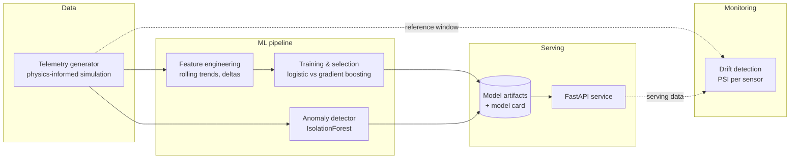

# FleetPulse — Predictive Maintenance for Vehicle Fleets


An end-to-end machine learning system for the automotive industry: it simulates telematics
from a mixed vehicle fleet (city cars, delivery vans, HGVs), trains a model that predicts
**component failure within the next 30 days**, and serves those predictions through a
production-style REST API with anomaly detection and data-drift monitoring.

Fleet operators lose money twice on maintenance: once when a vehicle breaks down on the
road (recovery, downtime, missed deliveries) and again when they over-service healthy
vehicles on a fixed schedule. Condition-based maintenance — servicing a vehicle when its
sensor data says it needs it — is the industry's answer, and this project implements the
ML core of such a system.

```text
$ curl -s localhost:8000/predict -d @vehicle_history.json -H "Content-Type: application/json"
{
  "vehicle_id": "VH-0002",
  "failure_probability": 0.9741,
  "maintenance_recommended": true,
  "risk_band": "high",
  "threshold": 0.391
}
```

**A deep-dive walkthrough of the codebase — module responsibilities, design decisions,
and trade-offs — is in [docs/CODE_ANALYSIS.md](docs/CODE_ANALYSIS.md).**

---

## Architecture



The same `build_features` function runs at training time and inside the API, which
eliminates train/serve skew by construction — there is no second, hand-rolled feature
implementation in the serving path.

## Quickstart

```bash
cd fleetpulse
pip install -e ".[dev]"

fleetpulse generate --out data/telemetry.csv     # simulate 60 vehicles × 365 days
fleetpulse train    --data data/telemetry.csv --out artifacts
fleetpulse drift    --data data/telemetry.csv    # PSI drift report
fleetpulse serve    --artifacts artifacts        # API on :8000, docs at /docs
```

Or as a self-contained container (trains its own model at build time):

```bash
docker build -t fleetpulse . && docker run -p 8000:8000 fleetpulse
```

## API

| Method | Endpoint | Purpose |
|---|---|---|
| `GET` | `/health` | Liveness + model-loaded status |
| `GET` | `/model/info` | Model card: name, training date, threshold, held-out metrics |
| `POST` | `/predict` | Failure probability for one vehicle from ≥ 8 days of telemetry |
| `POST` | `/predict/batch` | Same, for up to 100 vehicles per call |
| `POST` | `/anomaly/check` | Is this single sensor snapshot unlike anything seen in training? |

Interactive OpenAPI docs are auto-generated at `/docs`. Requests are validated against
physical plausibility bounds (a 300 °C engine temperature is rejected with a 422, not
silently scored), history must be in strictly increasing day order, and batch size is
capped — the API defends itself at the boundary.

## The ML problem, honestly

**Data.** Real fleet telemetry is proprietary, so the generator simulates it with the
properties that make the real problem hard: each vehicle carries a *hidden* wear state;
sensors are noisy functions of that state (oil pressure falls, vibration grows
super-linearly); failures repair imperfectly. Labels come from the future of the wear
trajectory, so the model can only succeed by reading degradation signatures out of
sensor history — the simulator never leaks its hidden state into the features.

**Features.** A single day's snapshot is a weak signal. Every sensor gets a trailing
7-day rolling mean, rolling standard deviation, and a 7-day delta. All windows are
strictly trailing; `tests/test_features.py::test_no_lookahead_leakage` corrupts future
rows and asserts past features are byte-identical — the most common silent failure in
time-series ML, caught by a test instead of a code review comment.

**Splitting.** Consecutive days of one vehicle are nearly identical, so a random row
split would leak test vehicles into training and inflate every metric. The split is
grouped by `vehicle_id` (`GroupShuffleSplit`): the model is always evaluated on vehicles
it has never seen.

**Model selection.** Two candidates are trained side by side and the winner is chosen by
held-out PR-AUC — keeping the linear baseline in every run makes the value of the more
complex model measured rather than assumed. Results on 15 held-out vehicles
(3,231 vehicle-days, 30.7% positive rate):

| Model | PR-AUC | ROC-AUC | Precision | Recall | F1 | Brier |
|---|---|---|---|---|---|---|
| Logistic regression (baseline) | 0.905 | 0.978 | 0.881 | 0.942 | 0.910 | 0.052 |
| **Hist. gradient boosting (selected)** | **0.966** | **0.987** | **0.883** | **0.942** | **0.911** | **0.042** |

The operating threshold (0.391) is chosen by maximising F1 on held-out data and recorded
in the model card; in production this would be a business decision trading workshop
visits against roadside breakdowns, and the code documents that.

**Beyond the classifier.** Two things a supervised model can't do are handled separately:

* **Anomaly detection** — an `IsolationForest` fitted on *healthy* readings only flags
  sensor faults and novel failure modes the classifier was never taught.
* **Drift monitoring** — Population Stability Index per sensor channel, with the
  standard 0.10 / 0.25 severity cut-offs, detects when the serving distribution has
  moved away from training (new vehicle models, firmware recalibrations) and retraining
  is due.

**Reproducibility.** Every artifact ships with a JSON model card: metrics for all
candidates, the chosen threshold, the exact feature list, library versions, training
timestamp, and the IDs of the held-out vehicles. `/model/info` serves it, so the API can
always say exactly what it is running.

## Engineering quality

| Check | Result |
|---|---|
| Tests | **31 passing** across 6 test modules |
| Line coverage | **98%** (410 statements, 8 missed) |
| Lint | `ruff` clean, complexity capped at 10 per function |
| CI | GitHub Actions: lint + tests on Python 3.10–3.12 with a 90% coverage gate, plus an end-to-end training smoke run |
| Typing | Type-hinted throughout (`from __future__ import annotations`) |

Tests assert *properties*, not just happy paths: generator determinism per seed, no
look-ahead leakage, rolling windows never crossing vehicle boundaries, train/test vehicle
disjointness, model-persistence round-trips producing identical probabilities, PSI ≈ 0
for identical distributions, and API rejection of implausible or unordered input.

## Project structure

```text
fleetpulse/
├── src/fleetpulse/
│   ├── config.py              # single source of truth for columns & defaults
│   ├── cli.py                 # generate / train / drift / serve
│   ├── data/generator.py      # physics-informed telemetry simulation
│   ├── features/engineering.py# trailing rolling-window features
│   ├── models/
│   │   ├── train.py           # candidates, grouped split, model card, persistence
│   │   ├── evaluate.py        # imbalance-aware metrics, threshold selection
│   │   └── anomaly.py         # IsolationForest on healthy readings
│   ├── monitoring/drift.py    # PSI drift report
│   └── api/
│       ├── schemas.py         # Pydantic contracts with plausibility bounds
│       ├── service.py         # schema ↔ pipeline translation layer
│       └── main.py            # app factory, lifespan model loading
├── tests/                     # 31 tests, 98% coverage
├── docs/CODE_ANALYSIS.md      # module-by-module design walkthrough
├── Dockerfile                 # non-root, healthcheck, self-training demo image
├── Makefile                   # install / lint / test / train / serve / docker
└── pyproject.toml             # packaging, ruff & pytest config
```

## Known limitations and what I'd build next

Honest scoping is part of the engineering:

* **Synthetic data.** The simulator preserves the *shape* of the problem but not its
  messiness — real telemetry has missing days, sensor dropouts, and mixed sampling
  rates. The next step is an ingestion layer with gap-tolerant features.
* **No authentication or rate limiting** on the API — fine for a demo service behind a
  gateway, not for a public endpoint.
* **Batch prediction is sequential**; for real fleet sizes I would vectorise feature
  building across vehicles in one frame (the pipeline already supports it).
* **Threshold is F1-optimal**, but the right objective is cost-weighted; the model card
  records the choice so it can be revisited with real cost data.
* **Drift report is a CLI tool**; productionising it means a scheduled job that compares
  the live request log against the training reference and alerts on `significant_shift`.

## License

MIT
